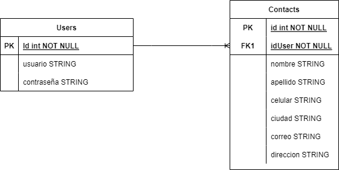

# Contact List
<h1 align="center">Developed by Juan Camilo Vargas 💻 </h1>

## Despliegue

Para realizar el despliegue debemos ejecutar los siguientes comandos:

En primer lugar ejecutaremos el backend, debemos tener en cuenta que para levantar el backend debemos tener nuestra base de datos corriendo, en este caso se tiene la base de datos MySQL corriendo en el puerto 3306 con la ayuda de XAMPP.

Debemos tener en cuenta que dentro del archivo [.env](./APIRest/.env) estan los valores para la conexion a la base de datos, como lo son: el host, el nombre de la base de datos, el usuario, la contraseña. 

``` bash
# Run
cd .\APIRest\
npm install
npm run dev
```
Ahora ya teniendo nuestra base de datos corriendo, junto con nuestra API REST (Backend) podemos levantar nuestro front con los siguientes comandos:

``` bash
# Run
cd .\contac-list-app\
npm install
npm start
```
De esta manera ya tendremos nuestra base de datos arriba, junto con nuestro backend y frontend.

## Diagramas

# Diagrama entidad Relacion

